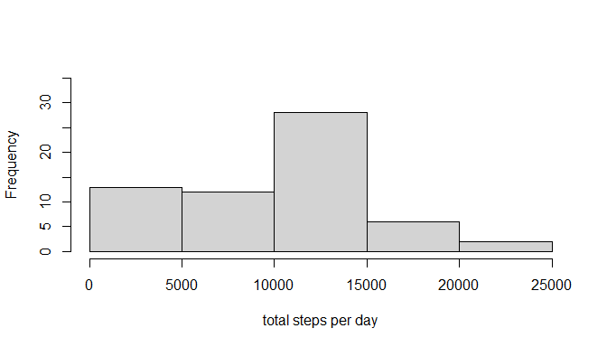
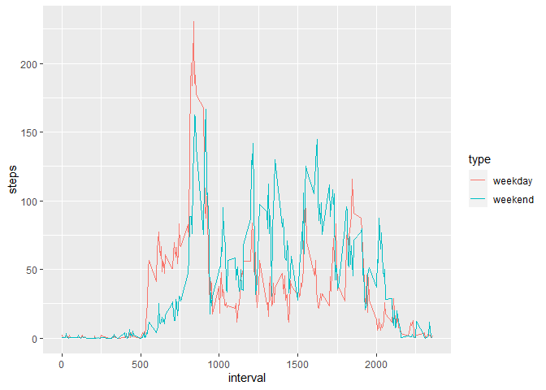

## (Down)Load Data

First, we download the zip file and extract the csv file. Then we import the data to R using read.csv.


```r
fileUrl <- "https://d396qusza40orc.cloudfront.net/repdata%2Fdata%2Factivity.zip"
download.file(fileUrl,"repdata-activity.zip")
unzip("repdata-activity.zip")

data<-read.csv("activity.csv",colClasses = c("integer","character","integer"))
names(data)
```

```
## [1] "steps"    "date"     "interval"
```

Convert the second column so that the dates are better to deal with lateron.


```r
library(lubridate)
data[,2] <- ymd(data[,2]) #dates come in the format year-month-day
```

## What is mean total number of steps taken per day?

The total number of steps taken per day is calculated using tapply (factor variable: date). We ignore the NA's, for the moment being. Plot the data using base plot system.


```r
StepsPerDay <- tapply(data[,1],data$date,sum,na.rm=TRUE)

hist(StepsPerDay, xlab="total steps per day",main="", ylim=c(0,35))
```

<!-- -->

The median and the mean can be either obtained from the summary


```r
summary(StepsPerDay)
```

```
##    Min. 1st Qu.  Median    Mean 3rd Qu.    Max. 
##       0    6778   10395    9354   12811   21194
```

... or using the corresponding built-in commands (we need to take care of the 'NA's!)


```r
median(StepsPerDay, na.rm = TRUE)
```

```
## [1] 10395
```

```r
mean(StepsPerDay, na.rm = TRUE)
```

```
## [1] 9354.23
```

## What is the average daily activity pattern?

To study the daily activity pattern, we make a time series plot of the 5-minute interval (x-axis) and the average number of steps taken, averaged across all days (y-axis)


```r
StepsPerInterval <- aggregate(list(mean=data[,1]),list(interval=data$interval),mean,na.rm=TRUE)

plot(StepsPerInterval, type="l",ylab="mean total number of steps",xlab="time of the day (format: hhmm)")
```

<!-- -->

Next we determine which interval has the heighest mean number of steps, i.e. which is the most active time of the day. To this end, we order our data by the mean.


```r
library(dplyr)

arrange(StepsPerInterval,desc(mean))[1,1]
```

```
## [1] 835
```
Note that the interval '835' corresponds 08:35 am in the morning.

## Imputing missing values

Calculate and report the total number of missing values in the dataset


```r
summary(data)
```

```
##      steps             date               interval     
##  Min.   :  0.00   Min.   :2012-10-01   Min.   :   0.0  
##  1st Qu.:  0.00   1st Qu.:2012-10-16   1st Qu.: 588.8  
##  Median :  0.00   Median :2012-10-31   Median :1177.5  
##  Mean   : 37.38   Mean   :2012-10-31   Mean   :1177.5  
##  3rd Qu.: 12.00   3rd Qu.:2012-11-15   3rd Qu.:1766.2  
##  Max.   :806.00   Max.   :2012-11-30   Max.   :2355.0  
##  NA's   :2304
```
So, we see that there are 2304 missing values in the dataset (i.e. approximately 13 percent). Quite a lot.

We replace the missing values by the mean number of steps for the corresponding interval (which we already calculated above).


```r
imputedData <- data #copy of original data
dataNA <-  data[is.na(data[,1]),] #time slots where number of steps is missing
imputedData[is.na(data[,1]),1] <- sapply(dataNA[,3],function(interval){StepsPerInterval[which(StepsPerInterval[,1] == interval,arr.ind=TRUE),2]})
```

To compare the imputed data with the original one, we first make a histogram


```r
StepsPerDayImputed <- tapply(imputedData[,1],imputedData$date,sum,na.rm=TRUE)

hist(StepsPerDayImputed, xlab="total steps per day",main="", ylim=c(0,35))
```

<!-- -->

This looks very similar to the histogram, which we obtained for original data. To get a better feeling, we compute mean and median of the new dataset:


```r
mean(StepsPerDayImputed)
```

```
## [1] 10766.19
```

```r
median(StepsPerDayImputed)
```

```
## [1] 10766.19
```
They are almost equal to the mean and median of our original dataset.

## Are there differences in activity patterns between weekdays and weekends?

We first create a factor variable which indicates whether a given date is a weekday or weekend day. To this end, we use the function 'wday' which comes with the lubridate package.


```r
getWday <- function(date){ifelse(wday(date, label = TRUE) %in% c("Mo","Di","Mi","Do","Fr"),"weekday","weekend")}
imputedData<- transform(imputedData,daytype=as.factor(getWday(data[,2])))
```

Now we make a time series plot of the 5-minute interval (x-axis) and the average number of steps taken, averaged across all weekday days or weekend days (y-axis).


```r
library(ggplot2)

stepsPerIntervalandTypeOfDay <- aggregate(list(steps=imputedData[,1]),list(interval=imputedData[,3],type=imputedData[,4]),mean)
ggplot(stepsPerIntervalandTypeOfDay,aes(x=interval,y=steps))+geom_line(aes(color=type))
```

<!-- -->

So we see that for the weekdays the activity is higher in the morning and evening, while at the weekend days the activity is higher during lich time/afternoon.
